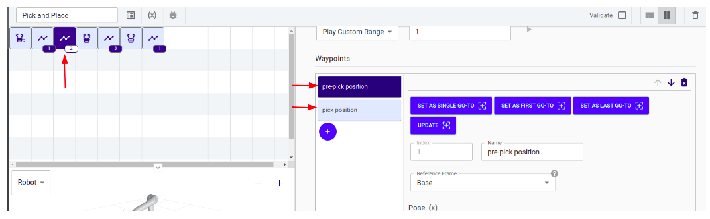
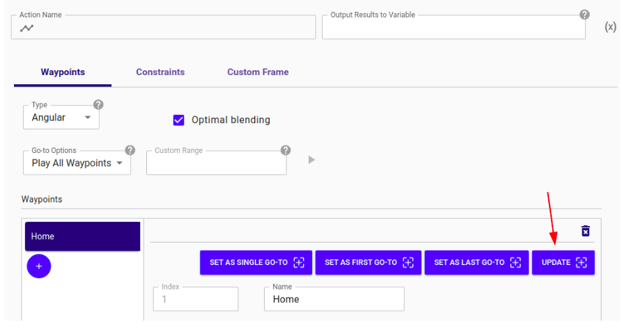

## Pick and place

**Summary**

The Pick and Place program is the basis of Link 6 programs. The program
introduces the **Waypoint** tile, the **Close-Gripper** tile and
the **Open-Gripper** tile. The goal of the program is to pick parts
and place them further on a chess board.

**Hardware and setup**

The Link 6 robot is equipped with a tool adapter and a gripper from
Robotiq Inc. To use the gripper, the Robotiq Gripper Plugin must be
downloaded from the Kinova website, by clicking on the Resources menu \> 
Plugins. Refer to the Link 6 User Guide or to the Robotiq Plugin
documentation for more detail. Download the file to a computer or an USB
stick, log in on Kortex Web App, click on the Menu \>  Systems \>  Plugins
\> click on the blue Add (+) Icon \> Select file \> Select the file
downloaded from the Kinova website \> Install. Once the file has been
installed, click on Robotiq Gripper Plugin and set Activate Plugin to
ON.

**Program detail**

Notice that in the beginning of the program, we set an Activate Gripper
tile from Plugins \> Robotiq Gripper Plugin. The Activate-Gripper tile
is necessary when using effectors from Robotiq because it calibrates and
initializes the gripper. The Activate Gripper tile isn\'t mandatory to
have at the beginning of each of the programs. For example, the tile
could be the only tile in an otherwise empty program, that should be
executed each time the robot is powered on.

The first and last waypoint tiles in the program contain a \"Home\"
position waypoint, in other words, a position in which the arm is safe
and can move to subsequent positions.

The following waypoint tile consists of \"pre-pick\" and \"pick\"
waypoints,

1.  The first waypoint moves the robot over an object; the position is called the pre-pick position.

2.  The second waypoint is the pick position; the pick position is when the robot arm is close enough to reach the object it is going to pick up.

3.  The gripper is closed with a Close-Gripper tile.

In the Close-Gripper tile settings, the force applied by the gripper can
be set to prevent crushing the piece that is picked up. The tile could
also be replaced by a move gripper tile, which moves the gripper to a
certain position.

After closing the gripper, the robot moves back to the pre-pick
position, followed by the pre-place position (right above the place
position), and to the place position, where the gripper opens and the
piece is dropped.

**How to recreate and customize the program**

To adapt this program for your application, it is possible to change the
waypoints. For example, it might be relevant to change the
"Home" waypoint and the pick/place positions for your application. Here
are the steps to change any waypoint:

1.  Click on the waypoint tile.

2.  Select the waypoint to change from the waypoint list.

3.  Hold the hand-guiding button on the robot.

4.  Move the robot to the desired position.

5.  Click on the \"Update\" button.

Should you want to use an end effector different from the Robotiq device used in this example, install the appropriate plugin, if any, and replace the gripper tiles in this program with the appropriate tiles. 
Note that most other brands of end effectors do not require an Activate tile.

&nbsp;

&nbsp;