## "Basic Matrix"

**Summary**

The program uses the **Matrix** tile to automate a pick and place
sequence on a grid. The Matrix tile can be found in the Robot menu,
along with the Waypoint tile. In this program, the robot picks four
parts in a square formation and places them further on a grid in
the same pattern.

**Hardware and setup**

The Link 6 robot is equipped with a tool adapter and a gripper from
Robotiq Inc. To use the gripper, the Robotiq Gripper Plugin must be
downloaded from the Kinova website, by clicking on the Resources menu \> 
Plugins. Refer to the Link 6 User Guide or to the Robotiq Plugin
documentation for more detail. Download the file to a computer or an USB
stick, log in on Kortex Web App, click on the Menu \> Systems \> Plugins
\ click on the blue Add (+) Icon \> Select file \> Select the file
downloaded from the Kinova website \> Install. Once the file has been
installed, click on Robotiq Gripper Plugin and set Activate Plugin to
ON.

To reproduce this example properly, 4 parts must be placed on a grid.
See the _How to recreate and customize the program_ section to learn
how to choose new coordinates for your grid.

**Program detail**

As in every program, the program starts with an Activate Gripper tile.
There is also a waypoint tile to a "Home" position at the beginning and
at the end of the program.

The Matrix tile is used to generate equally spaced positions depending
on the parameters given to it. In this program, there are two matrix
tiles, both configured as 2 by 2 (rows by columns). To save a matrix and
use its features, an `Object` type variable with a `Arm - Plugin -
Matrix Output` schema must be created. The variable is bound to a Matrix tile
by choosing it under the "Output Results to Variable" box in the
configuration of the Matrix tile.

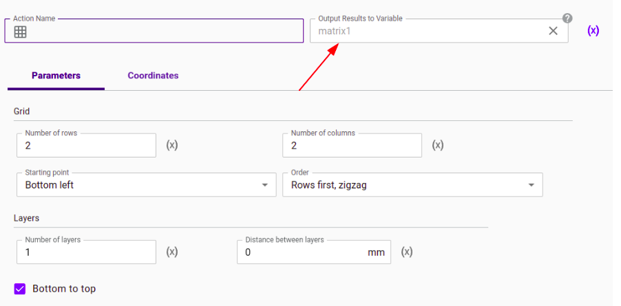

The first Matrix tile outputs results to the variable `matrix1`. 
This matrix generates the pick positions. The place positions are generated
and saved in the second matrix which outputs results to the variable `matrix2`.

A Loop tile is used in this program to repeat a series of actions a
specific number of times with the use of an iterator. In this program,
the loop must be repeated until each position generated by the matrix is
reached. A `Number` variable is created to be used as an iterator in a
Loop tile. The Loop tile is used to move the arm to each by iterating
through the generated poses of the matrix. To execute actions within the
loop, the tiles must be placed to the right of the arrow tile (below the
loop tile). Placing a tile in the same row as the loop tile will only
execute it after the loop has finished. Clicking on the loop tile
shows that it is configured to have the `index` `number` variable as
an iterator. In the loop tile settings, the maximum iteration is set to
`matrix1.poses.length` in order to reach every position generated by
`matrix1`. Within the loop, the same program design logic used in the
\"Pick and place\" program is applied, but instead of using specific
waypoint coordinates, the coordinates used are the poses generated by
the Matrix tiles.

The first Waypoint tile in the Loop contains two waypoints. The first
one consists of the poses generated by `matrix1` but the z-Coordinate is
changed because the waypoint is used as a pre-pick position. The second
waypoints has all of its coordinates to `matrix1.poses` since it is used
as a pick-position generated by matrix1.

After closing the gripper, the robot must move back to the
pre-pick position, followed by the pre-place position, which is why
waypoints \#2 and \#3 the next Waypoint tile uses the poses generated by 
the place matrix (`matrix2`) to move the arm to the place positions.
After the rest of the tiles are executed, the loop will restart but
the iterator (`index` variable) will increase by 1, therefore the robot
will then move to the next pose generated by each of the matrices. Each
pose used in waypoints will be automatically updated.

**How to recreate and customize the program**

First, the matrix must be configured depending on the number of equally
spaced positions needed. To do so,

1.  Click on the Matrix tile

2.  In the parameters menu, configure the matrix size by choosing a
     number of rows, a number of columns and a number of layers

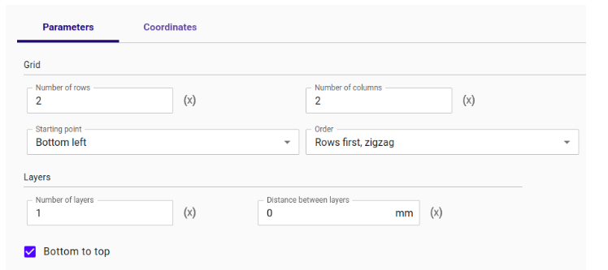

3.  Go in the Coordinates menu

4.  Record the required positions by holding the hand-guiding button on
     the robot and moving the Tool Center Point (TCP) to the origin
     (bottom left) of the grid, the bottom right of the grid and the
     top left.

5.  Click the Update button

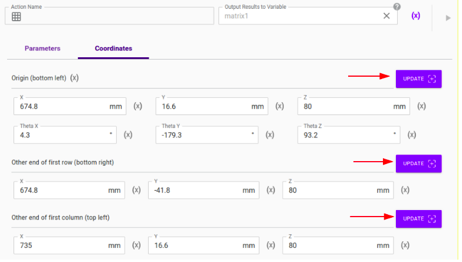

To set the maximum iterations of the Loop tile to `matrix1.poses.length`,

1.  Click on the Loop tile.

2.  Click on (X) next to the Maximum Iterations box.

3.  Click on the matrix1 or matrix2 variable (they are the same size).

4.  Select Poses from the drop-down menu.

5.  Check the "Add array length accessor" box.

6.  Click on Select.

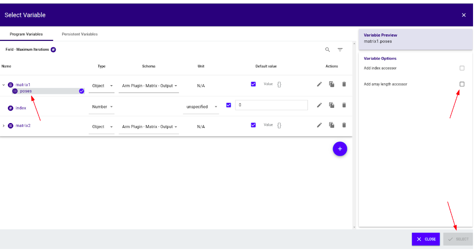

To use the positions generated by the matrix in a waypoint,

1.  Go to the waypoint tile.

2.  Create a waypoint.

3.  Click on the (x) icon next to the Pose subtitle in the Waypoint
     menu.

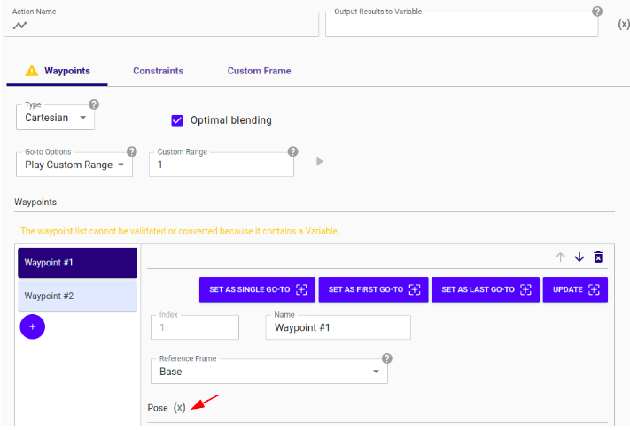

4.  Click the matrix variable that generates the pick positions, and
     select \"poses\" from the drop down menu.

5.  In the same Variable menu interface, click \"Add index accessor\" in
     the right-side window (named Variable Options).

6.  Select the variable called `index`.

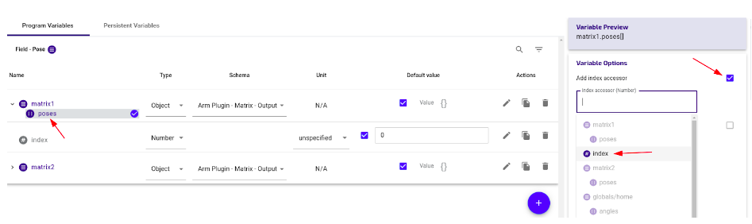

In this program, the pick matrix (\"matrix1\") generates the pick
position, therefore the z-Coordinate of the pre-pick waypoint has a
different value, which will move the robot arm above the piece. To
change the z-Coordinate,

1.  Click on the waypoint tile.

2.  Create a pre-pick waypoint (Waypoint \#1)

3.  Follow the same instructions to use positions generated by the
     matrix, as described above.

4.  Click on X in the z-Coordinate

5.  Change to value to have the robot arm above the piece.

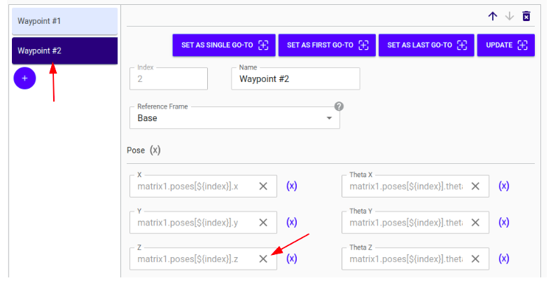
&nbsp;

&nbsp;

## "Matrix Tool Frame"

**Summary**

The \"Matrix tool frame Pick and place\" program is similar to the
\"Basic matrix Pick and place\" program, with the exception that the
matrices are recorded to generate **pre-pick and pre-place
positions** instead of pick and place positions. When programmed this 
way, using waypoints in the tool frame is useful because they are 
defined relative to the Tool Center Point (TCP), which in turn will
act as relative displacement, making the generation of waypoints
easier than having to measure the distance of every coordinate from
the robot base.

The output of this program is functionally identical to the \"Basic Matrix\" program.

**Hardware and setup**

In this program, the robot picks four parts in a square formation and
places them further in the same pattern. As in every program, the
program starts with an Activate Gripper tile. There is also a waypoint
tile to a "Home" position at the beginning and at the end of the
program.

The Link 6 robot is equipped with a tool adapter and a gripper from
Robotiq Inc. To use the gripper, the Robotiq Gripper Plugin must be
downloaded from the Kinova website, by clicking on the Resources menu \> 
Plugins. Refer to the Link 6 User Guide or to the Robotiq Plugin
documentation for more detail. Download the file to a computer or an USB
stick, log in on Kortex Web App, click on the Menu \> Systems \> Plugins
\ click on the blue Add (+) Icon \> Select file \> Select the file
downloaded from the Kinova website \> Install. Once the file has been
installed, click on Robotiq Gripper Plugin and set Activate Plugin to
ON.

To reproduce this example properly, 4 parts must be placed on a grid.
See the _How to recreate and customize the program_ section to learn
how to choose new coordinates for your grid.

**Program detail**

In this program, the pick and place waypoints are set by changing some
reference frames from the Base frame to the Tool frame and setting their
z-Coordinate as the distance between the pick/place position and the
pre-pick/pre-place position.

This process is repeated for the waypoint tile that contains the
pre-place and place waypoints, after closing the gripper. Notice that in
the waypoint tile between the Close-Gripper and the Open-gripper tiles,
a third waypoint containing the pre-pick position is added, because the
robot needs to move back to the pre-pick position after picking up the
object.

**How to recreate and customize the program**

To use the Tool Frame in order to generate a pre-pick position and a
pick position, first make sure the coordinates of the matrices are
pre-pick and pre-place positions. Then,

1.  Create a waypoint tile.

2.  Add a waypoint, following the instructions to use positions
     generated by the matrix, as described in the "Basic Matrix - Pick
     and Place" ReadMe. This waypoint is the pre-pick position.

3.  Add another waypoint to the tile. This waypoint will be the
     pick-position.

4.  Click on the box below "Reference Frame".

5.  Choose Tool.

6.  Set every coordinate to 0.

7.  Set the z-Coordinate to the desired distance between the pre-pick position and the pick position. Only the z-Coordinate has a non-zero value because the object is straight below the pre-pick position. If the object was to the right of the pre-pick position, only the y-Coordinate of the waypoint would have a non-zero value.

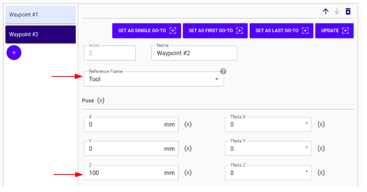
&nbsp;

&nbsp;

## "Matrix Custom Frame"

**Program Summary**

This program is functionally the same as the \"Basic matrix\" program, but
 uses a single matrix tile and **custom frames**. Custom frames are a useful
feature to define positions and trajectories relative to a point in the 
environment of the robot, often static relative to the task that must be
performed. 

**Hardware and setup**

In this program, the robot picks four parts in a square formation and
places them further in the same pattern. As in every program, the
program starts with an Activate Gripper tile. There is also a waypoint
tile to a "Home" position at the beginning and at the end of the
program.

The Link 6 robot is equipped with a tool adapter and a gripper from
Robotiq Inc. To use the gripper, the Robotiq Gripper Plugin must be
downloaded from the Kinova website, by clicking on the Resources menu \> 
Plugins. Refer to the Link 6 User Guide or to the Robotiq Plugin
documentation for more detail. Download the file to a computer or an USB
stick, log in on Kortex Web App, click on the Menu \> Systems \> Plugins
\ click on the blue Add (+) Icon \> Select file \> Select the file
downloaded from the Kinova website \> Install. Once the file has been
installed, click on Robotiq Gripper Plugin and set Activate Plugin to
ON.

**Program detail**

The coordinates of the origin of the matrix are set to zero, excluding
theta Y and theta Z since these coordinates orient the gripper in the
desired direction (down in the current example). The four parts are
placed in a square formation and at equal distance from each other. The
coordinates of the bottom left corner are set depending on the distance
between the parts, in this case -50 mm in the y-coordinate. The top left
corner of the grid is set to 50 mm in the x-coordinate. In the Custom
Frame menu of the first waypoint tile, a custom frame is created by
setting the origin to the desired first pick position.

Following the Close-Gripper tile, there is another Waypoint tile
containing a single pre-pick waypoint with the same custom frame as
before. The custom frame for this tile is identical to the custom frame
of the previous tile. However, the custom frame needs to be set again
manually since each tile has its own custom frame. With this in mind,
another waypoint tile is created to be able to use a new custom frame,
which has its origin set as the first place position (the same bottom
left position of the \"place\" matrix that was used in previous
programs). Again, the coordinates of the waypoint are set by clicking
the (x) icon next to poses, selecting poses from the same matrix
variable, and modifying the Z coordinate depending on whether it is a
pre-place position or not.

**How to recreate and customize the program**

In order to use the same Matrix tile for pick and for place positions,
the coordinates of the matrix need to be set manually, without Hand
Guiding the Tool Center Point (TCP) to the corners of the grid and
clicking the Update Button. The x, y and z-coordinates of the origin
must be set to 0 - this will locate the origin of your matrix at the
origin of your custom frame. The theta-x, theta-y and theta-z coordinates
determine the orientation of the TCP, therefore they can be non-zero 
values depending on the direction from which the parts are picked up.
In this program, the parts are picked from above which is why 
`Theta Y = 180` and `Theta Z = 90`. The distance between the bottom
left corner and the bottom right corner can be computed using this
formula:

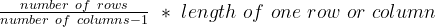

The same is done with the distance between the top left corner and the
bottom left corner.

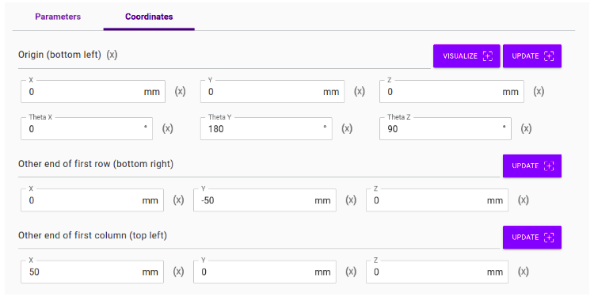

The Custom Frames in this program allow a single matrix to generate both
pick-positions and place-positions. This concept is explained in Figure
1.

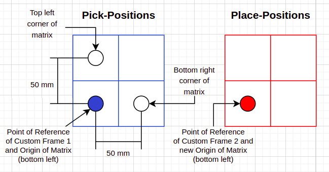

**Figure 1: Visual representation of generated Matrix depending on the Custom Frame of a Waypoint tile**

The Matrix tile generates the grid template seen in Figure 1, but the
grid's origin changes depending on the "Point of Reference" of the
custom frame. For example, the custom frame of the Waypoint tile
containing the pick-positions is configured to have its "Custom Point of
Reference" at the origin in BLUE. Thus, the Matrix tile generates a grid
using the Custom Point of Reference of Custom Frame \#1 as its Origin.

The Custom Frame of the Waypoint tile containing the place-positions is
configured to have its Custom Point of Reference at the origin in RED.
Thus, the same grid is generated further to the left of the pick
positions.

As done in the "Matrix Tool Frame - Pick and Place" program and the
"Basic Matrix - Pick and Place" program, to use the grid generated by
the Matrix tile in a Waypoint tile,

1.  Click the (x) icon next to poses,

2.  Click the matrix variable (\"matrix\"),

3.  Select \"poses\",

4.  Add an index accessor,

5.  Modify the z-coordinate of the waypoint if it is a pre-pick
    position.
&nbsp;

&nbsp;