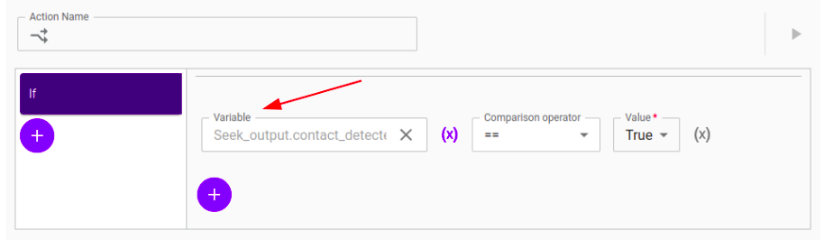

## "Gripper Output and Wait"

**Summary**

This program introduces the **Wait** tile from the Basic Action
menu, the **Condition** tile and the **Gripper Output** variable
available to use with any Gripper tile. More precisely, it is an `Object - Robotic Gripper Plugin - Output` variable that has three members. It
returns a boolean value after detecting the presence of the absence of
an object between the fingers of the gripper, a number corresponding to
the actual position reached by the gripper, and a number corresponding
to a requested gripper position. The goal of the program is to find out
if there is a part located at a waypoint position by using the `object
detected` attribute of the Gripper Output variable.

**Hardware and Setup**

The Link 6 robot is equipped with a Robotiq adapter and a gripper from
Robotiq Inc. To use the gripper, refer to the ReadMe of the Pick and
Place program or the Robotiq plugin documentation. As in every program,
the program starts with an Activate Gripper tile. There is also a
waypoint tile to a "Home" position at the beginning and at the end of
the program.

**Program detail**

The robot moves to the pick-position, over a part. A Close-Gripper tile
implements a `Object - Robotic Gripper Plugin - Output` the Gripper
Output variable is implemented in a Close-Gripper tile. The robot will
detect if an object is present between its gripper fingers after closing
and will store the information in the `output` variable.

The Condition tile executes actions only if a certain condition is met.
In this program, the condition checks if the boolean returned by the
`object_detected` attribute returns True. If that condition is met, a
waypoint tile moves the piece to a pre-pick position, a pre-place
position and a place position. Otherwise, a Wait tile makes the robot wait 5
seconds. The Wait tile is useful in a program if the robot must wait for
other processes to complete before resuming its movements. However, the
time to complete the process must be pre-determined and accurate to make
the Wait tile effective.

The piece is picked with a Close-Gripper tile. Therefore, if the gripper
feels there is an object at the pick position, the `object detected`
attribute of the `Object - Robotic Gripper Plugin - Output` variable
will return `True`, which will activate the actions following the arrow
of the Condition tile, as described previously.

**How to recreate and customize the program**

To use the `object_detected` attribute of the Gripper Output variable in
order to detect an object, an `Object - Robotic Gripper Plugin - Output`
must be created first. If you are using an OnRobot gripper with its associated plugin,
the procedure is the same.

1.  Click on the Gripper tile.

2.  Click on the "Output Results to Variable" box. The variable menu
    will pop-up.

3.  Click on the blue (+) icon to create a new variable and give the
    variable a name.

4.  Select `Object` as the Type

5.  Select `Robotic Gripper Plugin - Output` as the Schema. It can be of
    the type `Move`, `Activate`, `Close` or `Open`, as they are identical, but using the appropriate type can help you better distinguish
    variables in more complex programs.

6.  Click on the created variable and click Select.

The `object detected` attribute can be useful in a program if
implemented in a Condition tile. To do so,

1.  Select the Condition tile.

2.  Click on the "Variable" box.

3.  Choose the `Object - Robotic Gripper Plugin - Output` variable
    created previously.

4.  From the drop-down menu, select `object detected`.

5.  Click Select

6.  Select the `==` Comparison operator

7.  Enter "True" as the Value. Selecting True will execute the actions
    in the Condition tile only if an object has been detected between
    the fingers of the gripper. Selecting False will execute the same
    actions if no object has been detected.

&nbsp;

&nbsp;

## "Seek"

**Summary**

The program consists of picking up parts of varying heights from a
table. The **Seek** tile from the Link Toolkit plugin is introduced. 
The Seek feature makes the robot move linearly in a single
direction until it detects a configurable force using its built-in 
Force-torque sensor. Thus, the feature is useful for applications in
which the parts to be picked up or the surfaces have varying positions.
For example, stacking parts above each other or picking parts from a
stack means varying pick and place positions. By using the
Seek feature, counting the number of parts stacked and setting a
starting pick or place position is not required.

**Hardware & Setup**

The Link 6 robot is equipped with a Robotiq adapter and a gripper from
Robotiq Inc. To use the gripper, refer to the ReadMe of the Pick and
Place program or the Robotiq plugin documentation. As in every program,
the program starts with an Activate Gripper tile. There is also a
Waypoint tile to a "Home" position at the beginning and at the end of
the program.

**Program detail**

The program starts with a Close Gripper tile, creating a precise TCP
that is ready to detect a part. The Seek tile is configured with a small
Force Threshold of 1 N to prevent crushing the part. The Direction Axis
is set to Z+ in the Tool Reference frame for a maximum displacement of
400 mm. The Speed is set to 50 mm/s for safety purposes. The Seek tile
outputs its results to a variable called `Seek\_output`. This variable
is of type `Object` and the scheme is a `Link Toolkit - Seek - Output`.
A Condition tile is configured to execute actions if the boolean
returned by the `contact\_detected` attribute of the `Link Toolkit -
Seek - Output` variable returns True. If that condition is met,

1.  A Waypoint tile moves the TCP above the detected part to a pre-pick
     position, using a waypoint in the Tool Reference Frame.

2.  The Gripper is opened.

3.  A Waypoint tile moves the TCP to the position where the object has
     been detected with Waypoint \#1. Waypoint \#2 moves the TCP to a
     pick position using the Tool Reference Frame.

The rest of the program is similar to any basic pick and place program.
The gripper is closed with a Close Gripper tile. A Waypoint tile moves
the object to a pre-place and a place position and the part is released
with an Open Gripper tile.

**How to recreate and customize the program**

The feature of detecting a surface from the Seek tile can be put to use
in a Condition tile in order to execute a series of actions depending on
the detection of a contact. To do so,

1.  Click on the Condition tile.

2.  Click on the box under "Variable" in the configuration menu of an
     "If" statement.

3.  From the "Select Variable" menu, choose the variable that receives
     the output results of the Seek tile.

4.  Choose the `contact\_detected` attribute from the dropdown menu.

5.  Click Select.

In order to use the position where the TCP has detected a surface, also
known as the "contact pose",

1.  Click on the Waypoint tile, choose or create a waypoint.

2.  Click on the (X) icon next to "Pose".

3.  Choose the variable that receives the output results of the Seek
     tile.

4.  Select the `contact\_pose` attribute.

5.  Click Select.

&nbsp;

&nbsp;