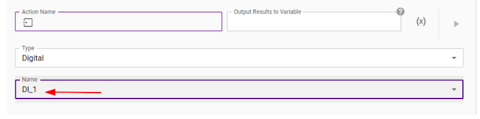

## "Basic Industrial IOs"

**Summary**

This program introduces the **Read Input**, **Set output** and
**Wait for Input** tiles from the Industrial IO Plugin, and the
**Message** tile from Basic.

**Hardware and Setup**

Open the side panel of the controller to access the industrial IOs. Verify the 
IO pannel is powered, usually by adding jumper wires between the 24V\_IN and 24V\_OUT,
as well as 0V\_IN and 0V\_OUT channels. To run this example, the DO\_0 channel should
be connected to the DI\_0 channel.

The output used in the example is configured as Push-Pull in the Industrial IO plugin
configuration page.

**Program detail**

A Set Output tile is used to send a High signal from a digital output to a digital input.
A Read input tile gets the state of the digital input and stores it in a variable called 'input'
A Message tile is used to display the content of the 'input' variable by printing it with `${}`
A Wait for input tile would wait for the input state to be high to proceed. In this example,
it should proceed right away.

In the second half of the example, the output is reset to Low and the same process of reading
and printing the input is repeated. Finally, a Wait for input tile will block the progress of
the program because the state of the IO will not be the state it is waiting for. This blockage
will be released after a 15 seconds timeout.

**How to recreate and customize the program**

The message tile can be used to print text that pops up on the Teach
Pendant's screen. However, the tile can also be used to output
variables. The correct syntax to output variables using a Message tile
is writing a dollar sign and brackets, like this `${ }`.The variable to
be printed is written inside the brackets. For example, if you want to
print the boolean generated by the `object_detected` attribute of a
Gripper output variable, the syntax would be
`${output.object\_detected}`.

In this example, the digital inputs DI\_6 and DI\_1 are used.
However, this program can be customized to activate or deactivate other
outputs. For example, this is how to customize the Set Output file to
another output.

1.  Click on the Set Output tile.

2.  Click on Name in the Settings section.

3.  Click on State in the Settings section, and choose High or Low.

Here is how to change Input read by the Read Input tile,

1.  Click on the Read Input tile.

2.  Click on Name.

3.  Choose the desired Input from the dropdown menu.

Finally, here is how to change the Input that the program waits for in a
Wait for Input tile.

1.  Click on the Wait for Input tile.

2.  Select Digital from the Type dropdown menu.

3.  Select the desired input from the Name dropdown menu.

4.  Select the desired state of the input chosen previously.

5.  A time in seconds can be added in the Timeout section. Once the
    desired amount of time has elapsed, the program will override the
    Wait for Input tile and continue executing the subsequent action
    tiles. Setting the timeout to 0 seconds means that there is no
    timeout, thus the program can't resume if the input has not
    reached the chosen state.

&nbsp;

&nbsp;

## "Advanced Industrial IOs"

**Summary**

This program uses the **Read Input**, **Set output** and
**Wait for Input** tiles from the Industrial Plugin. The purpose of
this program is to develop on the "Basic Industrial IOs" program by
showing how Industrial IOs can be combined with a pick and place program
to create an example of an useful Link 6 application for a factory.

**Hardware and Setup**

The Link 6 robot is equipped with a tool adapter and a gripper from
Robotiq Inc. To use the gripper, refer to the ReadMe of the Pick and
Place program or the Robotiq plugin documentation. As in every program,
the program starts with an Activate Gripper tile. There is also a
Waypoint tile to a "Home" position at the beginning and at the end of
the program.

The controller of the Link 6 robot is connected to a relay controller
setup from GennFlex (Model EDU-SYS-1-YA11 HARDWARE PACKAGE). The relay
controller is connected to a remote from GennFlex (Model:
GF-PD-10000\_IO) and a conveyor belt from MISUMI Corp (Model:
SVKA-100-500-25-TA115-SCM-5-HBN-B). The wiring diagram is as follows,

In this diagram, different colored wires represent they are separate.
The wires in the general purpose section of the robot controller are
connected to a relay controller in such a way that DO\_6 is linked to
a conveyor belt carrying pieces. Furthermore, the relay controller is
connected to the robot controller in such a way that DI\_2 is linked
to an infrared sensor at the end of the conveyor belt that activates
when an object is in front of it. Two separate wires are connected from
the relay controller to the first 24\_o and the first 0 V inputs of the
robot controller in order to power and ground the relay controller.

**Program detail**

The program starts with a **Set Output** tile from the Industrial IO
that sets the Digital output DO\_6 to Low. This de-activates the
conveyor belt because the conveyor is connected to DO\_6 on the
controller of the robot, allowing the user to run or stop the conveyor
by sending a signal to this output through the Teach Pendant.

A loop is implemented, starting with a **Move gripper** tile that
closes the gripper halfway, because the pieces are small and do not
require a fully open gripper. The Move Gripper tile replaces the Open
Gripper tile since the desired gripper opening is half of the full
opening. In our setup, a Move Gripper tile prevents hitting the infrared
sensor with the fingers of the gripper when fully open. A Set Output
tile sets DO\_6 to High activating the conveyor belt, followed by a
**Wait for Input** tile that waits for input DI\_2 to be
activated. The conveyor is activated until a piece is detected by the
infra-red sensor, in which case a Set Output tile sets DO\_6 to Low
stopping the conveyor. Now that the conveyor is stopped,

1.  A waypoint tile moves the robot arm above the piece, in front of the
     infra-red sensor.

2.  The gripper is closed using a Close-Gripper tile.

3.  The part is picked up using another Waypoint tile.

There is a Condition tile that has an "If" and three "If Else"
statements. Each statement is paired to a Waypoint tile and the
statements are executed depending on the value of the `index`
variable. This `index` variable is a `Number` that has a default
value of 1 and is used as an iterator for the Loop tile. That means the
value of `index` increases by 1 every loop. For each `index` value,
there is a different position waypoint, with a total of 4 different
positions. When `index=1`, the robot moves to the position on the far
left (position 1 out of 4), the loop restarts, and the Move Gripper tile
at the beginning of the loop makes the robot release the piece. The next
piece is placed at position two out of four, since the index is now
equal to 2. When `index=4`, the arm moves to the far right position
(position 4 out of 4) and a Set tile from the Basic tab sets
`index=0`. Now, when the loop restarts this index is increased by one
from zero, making `index=1`. Therefore, the next piece will be placed
back at position one out of four, and the cycle continues. All in all,
the Industrial IO Plugin lets one connect multiple systems to the
controller unit of the Link 6 robot, and to establish communication
logics between these systems.

**How to recreate and customize the program**

To connect separate machinery to the Link 6 controller, refer to the
machinery's electrical wiring instructions and to the wiring diagram
inside the controller's wiring panel. The controller wiring panel looks
like this,

The default factory wiring that comes with the robot looks like this.

Refer to the "How to recreate and customize the program" section in the
Basic Industrial IOs example for instructions about configuring Wait for
Input and Set Output tiles for your desired inputs and outputs.

A simple way to configure a Condition tile to have different actions is
to add an "Else if" statement for every Loop iteration. To do so,

1.  Create a `Number` type variable that will be used as an iterator.

2.  Click on the + button under the If statement.

3.  Click on the Variable box and select the `Number` type variable.

4.  Choose a comparison operator and a Value.

&nbsp;

&nbsp;