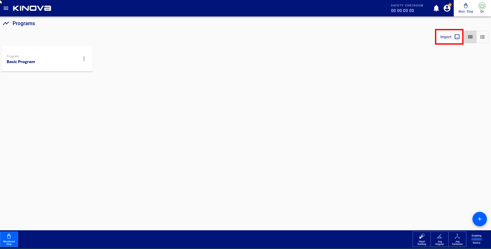

<!--
* KINOVA (R) KORTEX 3 (TM)
*
* Copyright (c) 2018 Kinova inc. All rights reserved.
*
* This software may be modified and distributed
* under the terms of the BSD 3-Clause license.
*
* Refer to the LICENSE file for details.
*
-->

<h1>Json Program Samples</h1>

# Description

This is a list of typical program that could be run on the arm. Each program comes with the explanation of how to use it. 

<h2>Table of Contents</h2>

<!-- TOC -->

- [Description](#description)
- [How to import a program save in Json](#Import-a-json-program)

<!-- /TOC -->

## How to import a program in Json

To import an existing program, you need to go in the web interface and press on the import button in the top right corner like we see in this picture. After that you can select your file.
 

__________________________

## Back to root topic: **[readme.md](../../readme.md)**  
